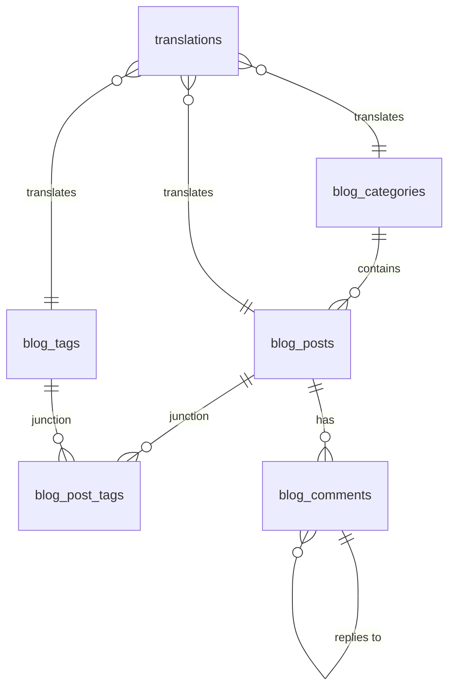

### Multi-Tenant Blog System V2 - Database Schema Documentation

This document describes the latest blog schema (V2) implemented for the dynamic backend. The primary focus of this update is to support multi-language content through a polymorphic translation system and to optimize query performance for high-traffic blog environments.

---

### 1. Architectural Overview

The V2 schema shifts from a fixed-column translation approach to a **Universal Polymorphic Translation Pattern**. This allows any field of any entity to be translated into any language without modifying the core entity tables.

#### Key Design Decisions:
- **Polymorphic Translations**: Centralized management of multilingual content.
- **Soft Deletes**: Used for Posts and Comments to preserve history and prevent broken links.
- **Hard Deletes**: Used for Categories and Tags to allow immediate slug reuse and maintain a clean taxonomy.
- **Nested Comments**: Native database support for threaded discussions.

---

### 2. Core Tables

#### 2.1 Translations (`translations`)
The heart of the multi-language system.

| Column | Type | Description |
|--------|------|-------------|
| `locale` | `VARCHAR(10)` | Language code (e.g., `en`, `fr`, `az`). |
| `translatable_type` | `VARCHAR(50)` | Entity type (e.g., `post`, `category`, `tag`). |
| `translatable_id` | `BIGINT` | ID of the linked entity. |
| `field` | `VARCHAR(50)` | Field name (e.g., `slug`, `title`, `content`). |
| `value` | `TEXT` | The translated content. |

**Indexes:**
- `idx_translation_poly`: Optimized for loading all translations for an entity.
- `idx_translations_slug_lookup`: **Critical** unique index for fast URL resolution across all entity types.

#### 2.2 Blog Categories (`blog_categories`)
Stores the taxonomy structure. All descriptive data (Name, Description, Slug) is stored in the `translations` table.

#### 2.3 Blog Tags (`blog_tags`)
Lightweight tags for post classification. Name and Slug are translatable.

#### 2.4 Blog Posts (`blog_posts`)
The main content entity.

- **Status Management**: `draft`, `published`, `archived`.
- **Media**: `featured_image` column for visual content.
- **Analytics**: `view_count` for basic engagement tracking.
- **Soft Delete**: `deleted_at` column used.

#### 2.5 Blog Comments (`blog_comments`)
Engagment system with threading support.

- **Parent-Child Relationship**: `parent_id` allows for nested replies.
- **Moderation**: `status` field (`pending`, `approved`, `rejected`).
- **Identity**: Stores `author_name` and `author_email` for guest or registered comments.

---

### 3. Relationships

---

### 4. Performance Optimization

The schema includes several critical composite indexes:

1.  **Slug Resolution**: A unique index on `(translatable_type, value, locale)` where `field = 'slug'` ensures that looking up a post by its URL is O(1).
2.  **Post Feed**: `idx_posts_status_published` covers the common query for the homepage/feed: `status = 'published' AND deleted_at IS NULL ORDER BY published_at DESC`.
3.  **Comment Threads**: `idx_comments_post_status` and `idx_comments_parent` optimize the loading of approved comments and their nested replies respectively.

### 6. Service & API Layer

The blog system is divided into two main layers:

1.  **Service Layer (`blog/service.go`)**: Contains business logic, manages translations, handles slug generation/resolution, and interacts with the database via GORM.
2.  **Controller Layer (`blog/controller.go`)**: Handles HTTP requests, parses locale from query/headers, and maps internal models to DTOs.

For detailed information about available endpoints and how to interact with the API, please refer to the [API Documentation](BLOG_V2_API.md).
